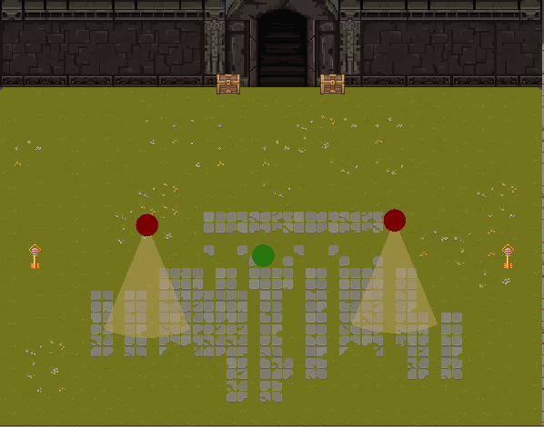

# Behaviour Tree Implementation
- Bianca Mirtes Araújo Miranda
- Stefane de Assis Orichuela

# Comportamento de Navegação Implementado
Para a segunda fase desse jogo, utilizamos o comportamento Wander com a tática de utilizar sequências de Seeks. 
Os NPCs inimigos que são identificados como os círculos vermelhos possuem em si um script chamado "SeekBehaviorWithPhysics" onde há um método que irá fazer 
a navegação em direção a um ponto no mapa em que a localização é modificada aleatoriamente toda vez que o NPC alcança aquele ponto. Isso faz com que o inimigo pareça estar 
vagando pelo mapa. 
Por exemplo: 
1. O jogo começa.
2. Um ponto no limite X1,X2,Y1,Y2 do mapa é gerado em uma posição aleatória.
3. O NPC com a navegação Seek vai até aquele ponto.
4. Ao chegar, o ponto muda de posição aleatoriamente.
5. O NPC novamente persegue aquele ponto. 

O Script que define o ponto aleatório no mapa é "RandomTeleport". 

Segue abaixo algumas imagens do jogo: Level 1 e 2

Level 1 com Árvore de Comportamento

Level 2 com Navegação Wander/Seek

