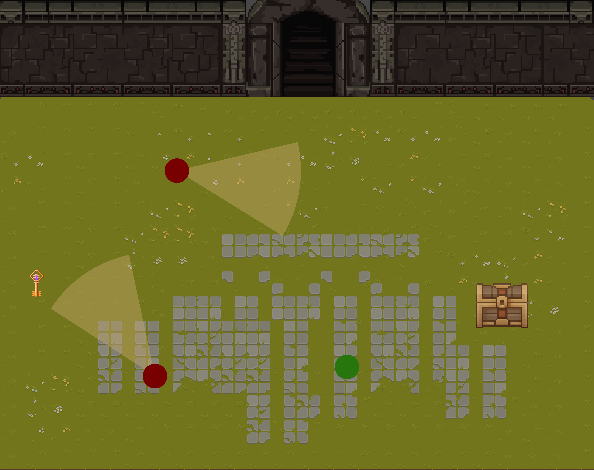

# Behaviour Tree Implementation
- Bianca Mirtes Araújo Miranda
- Stefane de Assis Orichuela

# Comportamento de Navegação Implementado
Para a segunda fase desse jogo, utilizamos o comportamento Wander com a tática de utilizar sequências de Seeks. 
Os NPCs inimigos que são identificados como os círculos vermelhos possuem em si um script chamado "SeekBehaviorWithPhysics" onde há um método que irá fazer 
a navegação em direção a um ponto no mapa em que a localização é modificada aleatoriamente toda vez que o NPC alcança aquele ponto. Isso faz com que o inimigo pareça estar 
vagando pelo mapa. 
Por exemplo: 
1. O jogo começa.
2. Um ponto no limite X1,X2,Y1,Y2 do mapa é gerado em uma posição aleatória.
3. O NPC com a navegação Seek vai até aquele ponto.
4. Ao chegar, o ponto muda de posição aleatoriamente.
5. O NPC novamente persegue aquele ponto. 

O Script que define o ponto aleatório no mapa é "RandomTeleport". 

Segue abaixo algumas imagens do jogo: Level 1 e 2

Level 1 com Árvore de Comportamento


Level 2 com Navegação Wander/Seek


# Minimax e A*
Para a terceira fase do jogo, utilizamos o algoritmo Minimax, utilizado para a tomada de decisões do NPC, associado ao algoritmo A*, utilizado para a escolha do melhor caminho para o destino escolhido com a tomada de decisão.

A Heuristica utilizada no algoritmo A* foi a Distancia de Manhattan:
```
A Distância de Manhattan, também conhecida como distância L1 ou distância de bloco, é uma métrica
utilizada em estatística e ciência de dados para medir a distância entre dois pontos em um espaço
multidimensional. Essa métrica é chamada assim em referência à grade de ruas de Manhattan, onde a
distância entre dois pontos é calculada apenas ao longo dos eixos, em vez de uma linha reta. A fórmula
para calcular a Distância de Manhattan entre dois pontos (x1, y1) e (x2, y2) é dada por |x1 – x2| + |y1 – y2|.
```
E as estrategias para a melhor escolha no Minimax foram:
